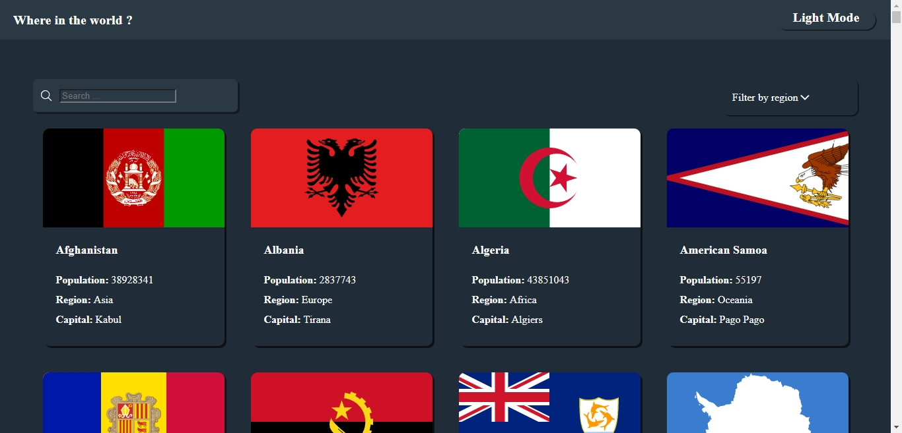
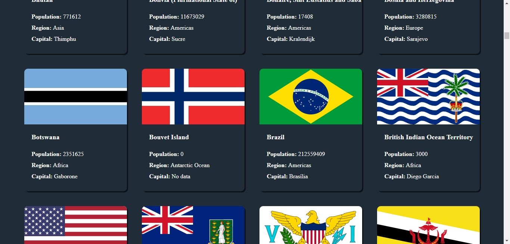
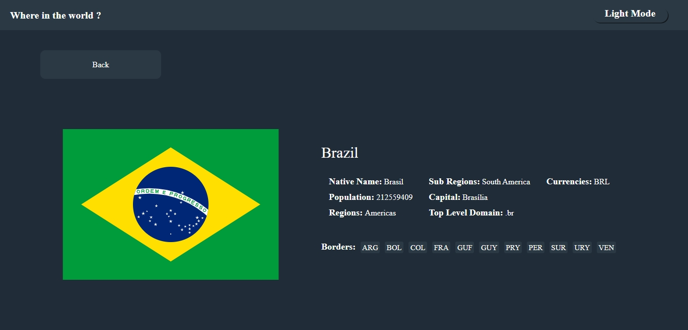
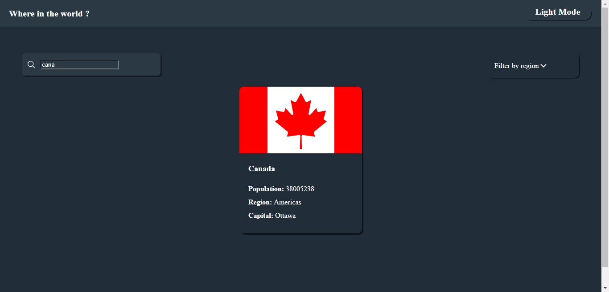

# Projeto de site com todos os países do mundo

# Site feito com React.js e usando a API restcountries(https://restcountries.com/) 
#*durante o desenvolvimento deste projeto a API rescountries sofreu algumas alterações necessitando reescrever parte do códido , se alguma parte do site não funcionar quando ser utilizado agora é possível que seja porque houve mudanças após a conclusam deste projeto.*

#Página inicial

#Mais países

#Foco em país específico

#Exemplo de pesquisa

